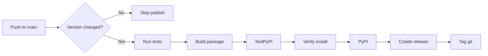

# PyPI Automation Setup Summary

**Date:** 2025-11-10
**Version:** 1.0.0
**Status:** ✅ Complete

---

## 🎯 What Was Implemented

Fully automated PyPI publishing pipeline that triggers on version changes to `main` branch.

---

## 📦 Files Created

### 1. **GitHub Actions Workflow**
**File:** `.github/workflows/pypi-publish.yml`

**7-Stage Pipeline:**
1. ✅ **Version Detection** - Only triggers when `__version__` changes
2. ✅ **Multi-Python Testing** - Tests on 3.10, 3.11, 3.12
3. ✅ **Package Building** - Builds wheel and sdist
4. ✅ **TestPyPI Staging** - Publishes to test.pypi.org first
5. ✅ **PyPI Production** - Publishes to pypi.org
6. ✅ **GitHub Release** - Auto-creates release with CHANGELOG
7. ✅ **Announcement** - Posts summary to workflow run

**Key Features:**
- Version change detection (no accidental re-publishes)
- Trusted publishing support (OIDC - no tokens needed)
- Fallback to API tokens (configurable)
- Multi-environment testing
- Staging → Production pipeline
- Automatic git tagging
- GitHub release creation with assets
- CHANGELOG extraction

### 2. **Setup Documentation**
**File:** `docs/PYPI_PUBLISHING_SETUP.md`

**Contents:**
- Complete setup guide for trusted publishing
- Alternative API token configuration
- Version bumping workflow
- Troubleshooting guide
- Best practices
- Monitoring instructions
- Pre-flight checklist

### 3. **Version Bump Script**
**File:** `scripts/bump-version.sh`

**Features:**
- Semver validation
- Updates `src/yavs/__init__.py`
- Updates `CHANGELOG.md`
- Interactive commit/push
- Git diff preview
- Color-coded output
- Safety prompts

**Usage:**
```bash
./scripts/bump-version.sh 1.0.1
./scripts/bump-version.sh 1.1.0 "Add new feature"
./scripts/bump-version.sh 2.0.0 "Breaking changes"
```

### 4. **README Updates**
**File:** `README.md`

**Added:**
- "Releasing & Publishing" section
- Quick release instructions
- Links to setup documentation
- Updated roadmap to v1.0 (current)

---

## 🔧 How It Works

### Automated Flow



### Version Detection

The workflow monitors `src/yavs/__init__.py` for changes:

```python
# Before: __version__ = "1.0.0"
# After:  __version__ = "1.0.1"  ← Triggers publish
```

**Smart Detection:**
- Compares current commit vs. previous commit
- Only triggers if version string actually changed
- Won't trigger on other file changes
- Manual workflow dispatch available as override

### Safety Features

1. **Multi-Python Testing**
   - Must pass tests on 3.10, 3.11, 3.12
   - Fails publish if any test fails

2. **Staging Environment**
   - Publishes to TestPyPI first
   - Tests installation from TestPyPI
   - Only then publishes to production

3. **Build Validation**
   - `twine check` validates package
   - Catches metadata issues before upload

4. **Manual Approval (Optional)**
   - Can configure `pypi` environment to require approval
   - Designated reviewers must approve production publish

5. **No Re-Publishing**
   - PyPI rejects duplicate versions
   - Version must be bumped for each release

---

## 🚀 Usage Examples

### Example 1: Patch Release

```bash
# Fix a bug
git checkout -b fix/bug-123
# ... make changes ...
git commit -am "fix: resolve issue #123"
git push origin fix/bug-123

# After PR merged to main
./scripts/bump-version.sh 1.0.1
# Prompts to commit and push
# Workflow automatically publishes to PyPI
```

### Example 2: Feature Release

```bash
# Develop feature
git checkout -b feature/stats-command
# ... implement feature ...
git commit -am "feat: add stats command"
git push origin feature/stats-command

# After PR merged
./scripts/bump-version.sh 1.1.0 "Add stats command"
# Auto-publishes v1.1.0 to PyPI
```

### Example 3: Manual Override

```bash
# Go to GitHub Actions
# Click "Publish to PyPI" workflow
# Click "Run workflow"
# Select branch: main
# Check "Skip tests" if needed (emergency only)
# Click "Run workflow"
```

---

## 📊 What Gets Published

### To TestPyPI
- URL: https://test.pypi.org/project/yavs/
- Purpose: Staging/testing before production
- Retention: Tests can be run, may have stale versions

### To PyPI
- URL: https://pypi.org/project/yavs/
- Purpose: Production release
- Install: `pip install yavs`
- Permanent: Cannot delete or overwrite versions

### GitHub Releases
- URL: https://github.com/YOUR-ORG/yavs/releases
- Contains:
  - Release notes from CHANGELOG.md
  - Source code (tar.gz)
  - Wheel distribution (.whl)
  - sdist distribution (.tar.gz)
- Git tag: `v1.0.1` format

---

## 🔐 Security Considerations

### Trusted Publishing (Recommended)

**Pros:**
- ✅ No API tokens to manage
- ✅ No secrets to rotate
- ✅ OIDC-based (modern, secure)
- ✅ Scoped to specific repo + workflow

**Setup:**
- Configure on PyPI website
- Specify: repo, workflow, environment
- No secrets needed in GitHub

### API Tokens (Alternative)

**Pros:**
- ✅ Works with any CI/CD
- ✅ Familiar workflow

**Cons:**
- ❌ Tokens need secure storage
- ❌ Need to rotate periodically
- ❌ Broader scope (project-level)

**Setup:**
- Generate on PyPI website
- Store in GitHub Secrets
- Update workflow to use token

---

## 📋 Setup Checklist

Before first publish:

- [ ] **PyPI Account**
  - [ ] Claimed package name: `yavs`
  - [ ] Configured trusted publisher OR
  - [ ] Generated API token

- [ ] **TestPyPI Account** (optional but recommended)
  - [ ] Claimed package name: `yavs`
  - [ ] Configured trusted publisher OR
  - [ ] Generated API token

- [ ] **GitHub Repository**
  - [ ] Created environment: `pypi`
  - [ ] Created environment: `testpypi`
  - [ ] Set environment protection (optional)
  - [ ] Workflow file committed

- [ ] **Testing**
  - [ ] Ran `./scripts/bump-version.sh` locally
  - [ ] Verified CHANGELOG.md format
  - [ ] Tested workflow with dry-run (optional)

---

## 🐛 Troubleshooting

### Workflow Not Triggering

**Check:**
1. Did `src/yavs/__init__.py` actually change?
2. Was it pushed to `main` branch?
3. Is workflow enabled in Actions tab?

**Debug:**
```bash
# View recent workflow runs
gh run list --workflow=pypi-publish.yml

# Check why workflow was skipped
gh run view --log
```

### "File already exists"

**Cause:** Trying to publish same version twice
**Fix:** Bump version higher

```bash
# If last published was 1.0.1
./scripts/bump-version.sh 1.0.2
```

### Tests Failing

**Cause:** Code changes broke tests
**Fix:** Fix tests before publishing

```bash
# Run tests locally
pytest tests/ -v

# Or use make
make test
```

### OIDC Verification Failed

**Cause:** Trusted publishing config mismatch
**Fix:** Verify PyPI settings match exactly:
- Repository owner/org name
- Repository name
- Workflow filename
- Environment name

---

## 📈 Monitoring

### Download Stats

```bash
pip install pypistats

# Recent downloads (last week)
pypistats recent yavs

# Overall stats
pypistats overall yavs

# By Python version
pypistats python_minor yavs

# By OS
pypistats system yavs
```

### GitHub Stats

```bash
# Release downloads
gh release list

# Specific release
gh release view v1.0.1

# Workflow success rate
gh run list --workflow=pypi-publish.yml --status success
```

### PyPI Stats

- View on PyPI project page
- https://pypi.org/project/yavs/#history
- Shows:
  - Download counts
  - Release history
  - File sizes
  - Python version support

---

## ✅ Success Criteria

After setup is complete, you should have:

1. ✅ **Automated Publishing**
   - Version bump → automatic PyPI publish
   - No manual intervention required

2. ✅ **Safety Checks**
   - Tests run before publish
   - Staging environment validation
   - Build verification

3. ✅ **Visibility**
   - GitHub releases created automatically
   - Git tags added
   - Workflow summaries posted

4. ✅ **Documentation**
   - Setup guide available
   - Version bump script working
   - README updated

5. ✅ **Tested**
   - Published at least one test version
   - Verified installation from PyPI
   - Confirmed GitHub release created

---

## 🎉 Ready to Publish!

Your PyPI automation is now fully configured and ready for:

```bash
# Publish v1.0.1
./scripts/bump-version.sh 1.0.1

# Watch it auto-publish
gh run watch

# Verify
pip install yavs==1.0.1
```

**Happy shipping!** 🚀
